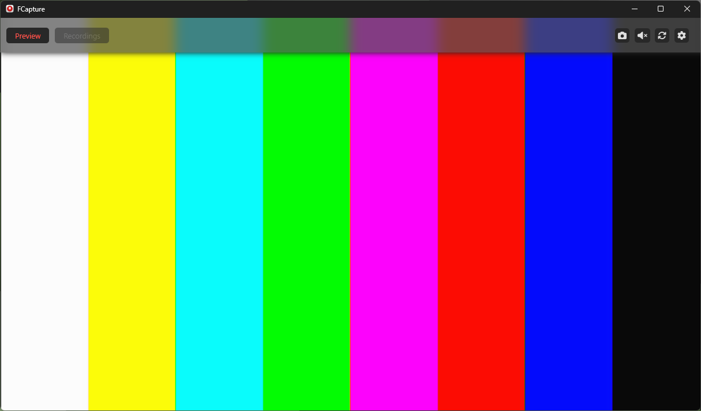
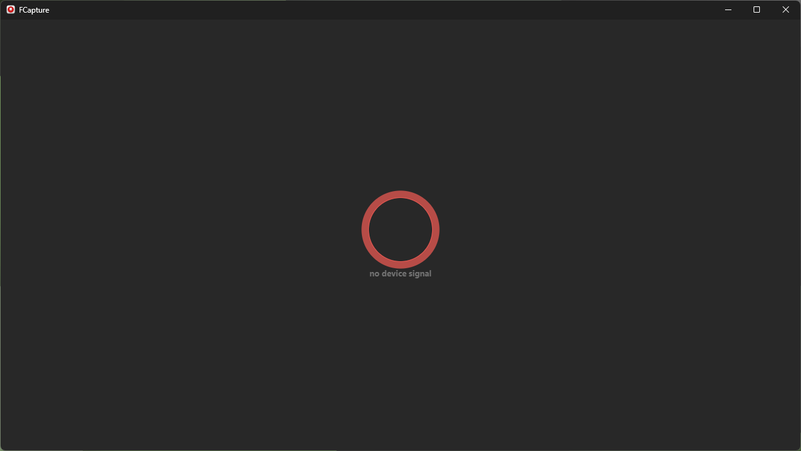
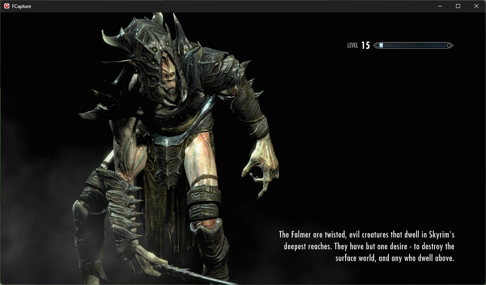
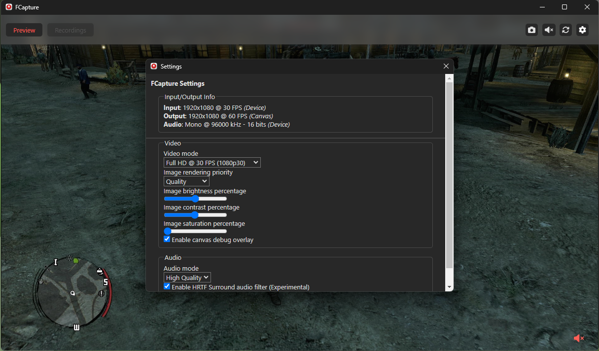

# FCapture

FCapture is a previwer (and a eventually a recorder) software for generic (off-brand) USB capture cards. FCapture is made entirely using Electron and a native web APIs.
This app is meant for the people that doesn't want to use a third-party software such as OBS or VLC just to preview the capture card's video output. _(I know that with OBS you can record your gameplay, but some folks just want to play and OBS is a little overkill for that)_

My goal with this app is to make an open-source alternative for anyone to use.

### Key features

- Preview video from generic USB capture cards _(and possibly PCI-E ones)_
- An extensive Settings menu with video and audio filters, different video and audio modes _(change stream output quality/resolution)_ and more
- Take screenshots of your gameplay/output at any time
- Since this is an Electron app, multiplaform support is also present with FCapture. The app can run on macOS, Linux and Windows

### Screenshots



<details>
  <summary>Click to expand for more images:</summary>

  
  
  

</details>

***


## Installation (for Developers or Contributors)

This app is under heavily development and its subject to change. So if you want to contribute or report any bugs, feel free to make a pull-request!

1. Clone the repository:
```sh
  git clone https://github.com/otvv/fcapture.git
  cd fcapture
```

2. Install dependencies:
```sh
npm install
```

3. Run or build the app:
```sh
# run the app locally 
npm start
```
```sh
# build the app using the appropriate script based on your platform (OS)
npm run build

# there's also alternative build scripts in case the normal method doesn't work.
npm run buildAltUnix # (macOS and Linux using bash)
npm run buildAltWin # (Windows using PowerShell)

# if you need to sign the app on macOS separately run:
npm run signAppMac # this will use the "adhoc" signing method.

# NOTE: If you get errors while trying to build the app, install 'electron-builder' as a global package
npm install -g electron-builder
```

**NOTE**: The build script file will also throw errors if there's a dependency missing. _(It will tell you which one and how to install it)_

***

### LICENSE:

This project is licensed under the Apache-2.0 License. See the [LICENSE](./LICENSE) file for details.